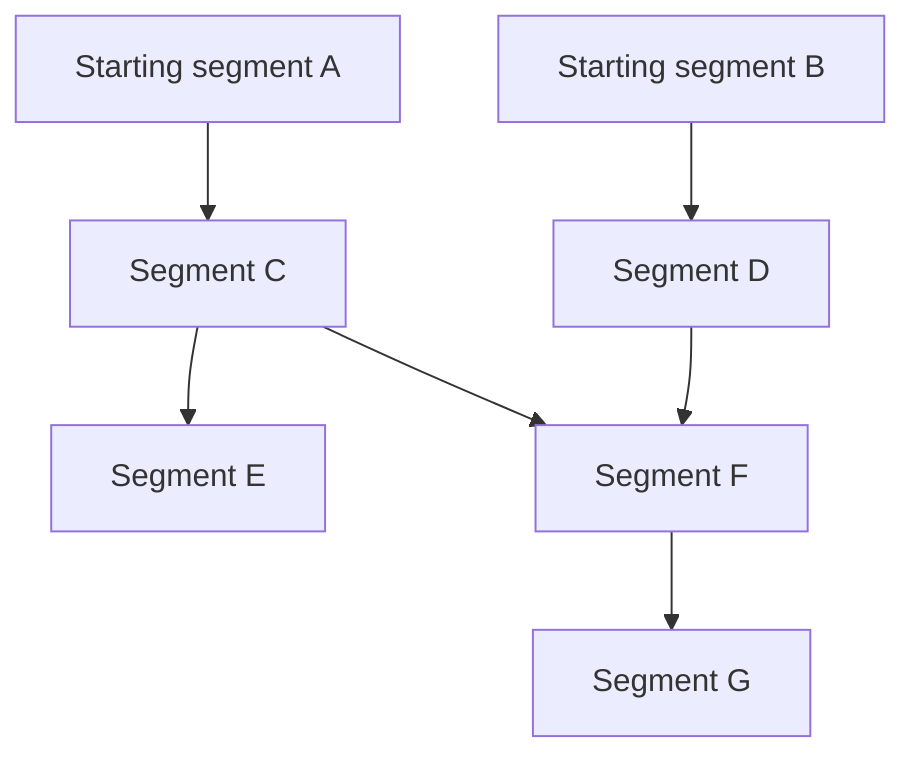

# Organising a learning roadmap

This document records the structure we use to organise a field of study. It is intended to work across STEM and to accommodate connections between domains. The structure defines how we describe subjects, divide material into units of study and show routes through them. The choice of subjects and the extent of coverage remain editorial decisions for each curriculum.

## Subject hierarchy and learning connections

The organising hierarchy is:

**Domain → strand → segment → topics and subtopics**

- A domain is a broad field of study.
- A strand is a coherent subject within that field, with room for a sequence of segments.
- A segment is a bounded unit of study with an identifiable scope and entry requirements.
- Topics and subtopics specify the concepts covered by that segment.

Each segment has a primary home in this hierarchy. Dependencies connect it to segments wherever they belong, including other domains. These connections form the learning graph. A subject's position in the hierarchy tells the reader what it concerns; its dependencies tell the reader what to study beforehand.

“Part of” and “requires” are different relationships. A specialist subject can belong within a broader subject while requiring knowledge from several others. We should explain that relationship in its description without treating subject membership as a prerequisite or duplicating the same material in several strands.

## Multiple beginnings, branches and convergence

The graph can have several starting segments. A starting segment has no prerequisites within the map, relative to the baseline knowledge we have declared for its readers. We do not need to invent a common starting point or trace prerequisites back indefinitely.

A segment can support several later segments, creating a branch. A later segment can require several earlier ones, creating a point of convergence. These connections can stay within a strand or cross between strands. In the sketch below, each letter represents a segment; arrows run from prerequisite to dependent segment.

Here, A and B are independent starting points. C supports two routes, and F brings knowledge from C and D together. F could begin a specialist strand if the subject warrants its own continuing route. Convergence alone does not require a new strand.

Prerequisites must come before the segments that use them. Otherwise, independent routes may be followed in different orders. Vertical position expresses this progression, not a universal ranking of difficulty. Two adjacent segments need not depend on each other simply because they share a strand or appear consecutively on the page.

A learning route should avoid circular prerequisites. When two treatments appear to require each other, we should distinguish an introductory treatment from a later, deeper treatment. The broader web of conceptual relationships can contain mutual connections; the required study sequence must still be followable.

A recommended reading sequence is another relationship. Two segments can follow one another within a strand without the second requiring the first. An explicit succession can give readers a continuous route through related material while the prerequisite list records the knowledge each segment needs. The map can draw that succession within a strand and preserve prerequisite connections between strands. Study order must respect prerequisites, but independent topics do not automatically need separate visual paths. The current authoring format records this optional succession with `follows`. A curriculum may instead require the previous step to be completed, making its succession cumulative. In that case, record the previous step as a dependency and inherit its requirements. This is an educational entry requirement; it does not imply that every earlier model is necessary for every later derivation. Classical mechanics currently uses this cumulative interpretation.

## What qualifies as a strand

A strand should have a recognisable subject identity, a coherent direction for further study and a useful reason for readers to follow it separately. Its name should remain meaningful as introductory and advanced segments are added. A new topic, a difficult technique or a change in academic level does not automatically justify a new strand.

A strand may contain only one documented segment today. That is acceptable when its scope and direction are clear. We should neither add filler segments to make it look substantial nor create a separate strand for every isolated topic.

We distinguish two roles:

- **Foundational strands** cover broad subjects that support many routes. They can extend from introductory material into advanced study.
- **Specialist strands** develop a distinct focus through their own sequence of segments, drawing on knowledge from existing strands.

These roles describe scope, not difficulty, age or importance. Advanced material can remain foundational. A specialist route can begin with an accessible introduction. Academic levels can help us check coverage, but they do not determine where one strand ends and another begins.

## How strands develop

Strands need not begin together or continue to the same endpoint. Some begin near the entry level; others emerge later when their prerequisites become available. An existing strand can continue while also supporting new specialist routes. Several strands contributing to one segment does not mean that those subjects have merged completely or ceased to develop independently.

An endpoint marks the boundary of our documented route. It might represent a deliberate coverage limit, material still to be written or an invitation to further study. It does not claim that the subject itself is complete. We should state that boundary so readers can distinguish the curriculum we provide from the wider field.

## Documenting and extending the map

For each strand, record its scope, its foundational or specialist role, its relationship to broader subjects, its segments and the limits of current coverage. For each segment, record its primary strand, direct prerequisites and topics and subtopics. Dependencies should name knowledge actually needed for that treatment; optional connections can be described separately.

New segments can be inserted wherever their prerequisites place them. Existing segments can be divided when they contain distinct stages of study, and specialist strands can be introduced when their material supports a coherent route. These changes should preserve useful identities and avoid unnecessary duplication. The map is a maintained curriculum whose structure can grow as our coverage and understanding improve.

Segment progression is recorded separately with `stage: Foundations` or `stage: Advanced`. Foundations establishes the concepts, laws, models and methods of the strand. Advanced develops deeper treatments, demanding models or additional methods. Branching and convergence are expressed through the graph, not stage labels. See [Segment stages](roadmap-stages.md). The current file format and authoring workflow are documented in [Writing the physics roadmap](roadmap.md).
